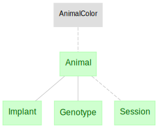
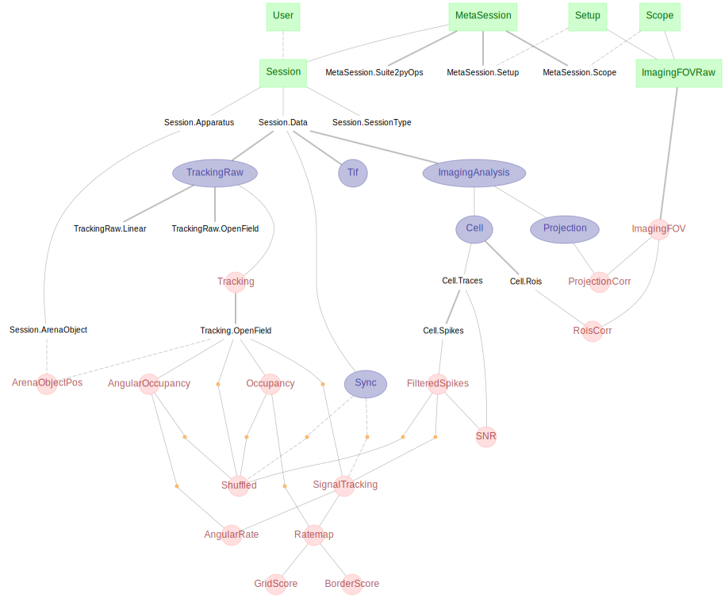
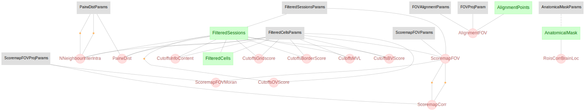
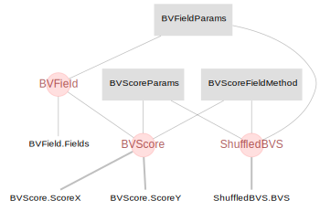

# Data and Code used in _Functional network topography of the medial entorhinal cortex_
Horst A. Obenhaus, Weijian Zong, R. Irene Jacobsen, Tobias Rose, Flavio Donato, Liangyi Chen, Heping Cheng, Tobias Bonhoeffer, May-Britt Moser, Edvard I. Moser

Code:

[](https://zenodo.org/badge/latestdoi/452277116)


Data: [10.11582/2022.00005](https://archive.sigma2.no/pages/public/datasetDetail.jsf?id=10.11582/2022.00005)

## DATA

Data is provided at (DOI TBD HERE) on the Sigma2 data repository
The dataset comprises of 1 file: `dump.sql`

### Dataset description

The data is provided as a dump from a MySQL database. To read the data out, please import the data into your own database. For maximum compatibility, MySQL version 5.7.36 is recommended. Later versions of MySQL, or other SQL compatible databases such as PostgreSQL may be used but are not explicitly supported. 

Why is data provided in this form?

Most research data is published in its most minimal form: typically, the raw recordings generated by data acquisition hardware, and possibly some critical intermediate processing (such as the outcome of cluster-cutting or similar software). It provides very little visibility into what the researchers actually did with the data, beyond the general descriptions covered in the paper itself.

This publication is an attempt to provide more visibility into the analysis pipeline that the data flowed through. 

Data analysis, in this case, comprises multiple serial stages: the output of one stage forming the input to the next. 
The output of each of these stages are stored in a series of tables in a database. Code for generating the figures in this paper refere back to various tables within this pipeline.

The SQL dump in this dataset reproduces those tables in their entirety.

The SQL dump is approximately 95GiB in size, and will provide an output databse of the same size. 


### Limitations of this dataset

One of the goals of data transparency is to enhance reproducibility. That goal is the motivation behind publishing data in this format: you can see not just what goes in at one end (the raw data) and what comes out at the other (the paper, figures, conclusions etc), but the various intermediate stages in between. 

Reproducing this data in its entirety, down to floating point accuracy, means recreating every individual facet of the analysis pipeline to a degree that is effectively impossible, and we have not attempted this Sisyphean task. Instead a best-effort attempt has been made to pin down the critical dependencies, such as the core Python libraries. Transitive and invisible dependencies, such as operating system libraries have not been pinned and are not recorded here. 


### Accessing data from `dump.sql`

0. Provide a local SQL database server to contain the data

  * If you have your own server already, skip this step
  * If not, we have provided a Docker container image and compose file to get started. The docker file is intended for x64 only: users of non-x64 processors (e.g. arm based computers such as Raspberry Pis or M1-powered Apple computers) will need to find an alternative solution.
  * [Install Docker](https://docs.docker.com/get-docker/) and [Docker-Compose](https://docs.docker.com/compose/install/)

1. Load the data into your database server

  * These instructions assume that you are using the docker container approach
  * Download the `dump.SQL` file.
  * You will need to adjust the `docker/docker-compose.yaml` file to suit your file system. The two values you need to change are the location of the `dump.sql` file, and the location where the container will store its contents:. Note that the format is `-<location on host computer>:<location inside container>`. The location inside the container does not need to be changed. 
```bash
    volumes:
      - </HOME/USER/DOWNLOADS>:/tmp
      - </HOME/USER/MYSQL>:/var/lib/mysql
```
  * Additional help for the compose file is [here](https://github.com/datajoint/mysql-docker)
  * Initialise the docker container by calling `docker-compose up -d`
      + You can check the status of the container by calling `docker-compose ps`
      + You can shut down the container by calling `docker-compose down`
      + Note: as long as your `/HOME/USER/MYSQL` directory is intact, you will not lose data in the database in between `docker-compose up -d` and `docker-compose down`
  * Import the data from the `sql.dump` into the docker container with
    `docker exec -it sqldump_db_1 bash -c "mysql -u root -p"simple" < /tmp/dump.sql"` (command stored in `docker/load.sh`)
      + You will only need to do this _once_ to import the data into the MySQL database. Any subsequent `docker-compose up -d` will already have this data imported.
  * note that the compose file specifies a password of `simple` for the default user (`root`). It is _not_ recommended to expose the database server to the outside world with these simple, default, credentials!

2. Access the data in the language of your choice.

  * Most programming languages provide connectors for most SQL databases. 
  * The Python (and Matlab) package `datajoint` is the standard connector used in the Moser labs, and specifically within this repository
  * Documentation for Datajoint is available [here](https://www.datajoint.org/)
  * Datajoint requires some minimal configuration information to identify the database server to connect to and with what credentials. This configuration block can either be added to the head of each file, or saved to a local or global config file. See the datajoint documentation for details. 
  * Documentation for the pipelines from which this data is exported can be found [here](https://moser-pipelines.readthedocs.io/en/dj-moser-imaging/)
  * Configuration is included, but commented out in `dj_schemas/dj_conn.py`. This is used by all of the other scripts in the repository, and can be updated, once, there
```python
import datajoint as dj
dj.config["database.user"] = "root"
dj.config["database.password"] = "simple"
dj.config["database.host"] = "localhost"
dj.config["database.port"] = 3306
dj.config.save_local()

animal = dj.schema("group_shared_topopaper_mlims")
imaging = dj.schema("group_shared_topopaper_main_imaging")
imhotte = dj.schema("group_shared_topopaper_horst_imaging")
bs = dj.schema("group_shared_topopaper_borderscore")
for sch in (animal, imaging, imhotte, bs):
    sch.spawn_missing_classes()
```

3. Reproducing figures in the paper

  * Code for each figure is provided either as a standalone Python script (`*.py`) or an interactive Jupyter notebook (`*.ipynb`). A guide for either is outside the scope of this readme, but [here](https://jupyter-notebook-beginner-guide.readthedocs.io/en/latest/) are some [good](https://www.python.org/about/gettingstarted/) places to [start](https://stackoverflow.com/).
  * The figure generators have been tested against the production environment of the Moser group, i.e. our primary database and users' individual Python environments. 
  * It is recommended that you create your own virtual environment either via `venv` or `conda`. Some python package versions used in processing data for this paper are specified in `requirements.txt`.


### Figure generating code
Code that recreates figures in the paper and reads data directly from the re-instantiated database can be found under 
- `Paper_topography_figures` (*.py files)
- `Paper_topography_notebooks` (*.ipynb notebook files)

### Relational diagrams of table structure
The following are [relational diagrams](https://docs.datajoint.org/python/definition/11-ERD.html) that show the most important tables for each database listed above. 

#### Animal information `group_shared_topopaper_mlims`
This database contains animal related information. 
Code under `clone_pipeline/pipeline_code/group_shared_topopaper_mlims.py` 



#### Main imaging database `group_shared_topopaper_main_imaging`
This is the part of the imaging database that contains most information pertaining to experimental setups, all tracking and signal data, up to processed data like ratemaps and scores.
Code under `clone_pipeline/pipeline_code/group_shared_topopaper_main_imaging.py`



#### Information specific to this publication `group_shared_topopaper_horst_imaging`
Code under `clone_pipeline/pipeline_code/group_shared_topopaper_horst_imaging.py`



#### Boundary vector score `group_shared_topopaper_borderscore`
Code under `clone_pipeline/pipeline_code/group_shared_topopaper_borderscore.py`. See also the [main repository](https://github.com/horsto/boundary_vector_score) for this datajoint schema and its code. 




